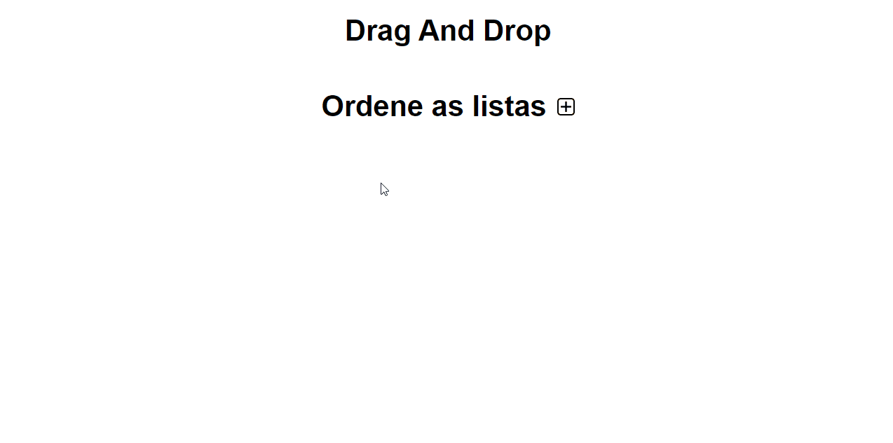

<h1 align="center">
    <span align="center">Dran and Drop</span>
</h1>

<p align="center">
    <a href="#headphones-about">About</a> •
    <a href="#rocket-getting-started">Getting Started</a> • 
    <a href="#computer-how-it-works">How it works</a> •
    <a href="#microscope-technologies">Technologies</a> • 
    <a href="#pencil2-author">Author</a> • 
    <a href="#pencil-license">License</a>
</p>

## :headphones: About

The project consists in a drag and drop list, with another drag and drop list inside, also including certain features such as: text editing, deletion of lists and items within it, among others.

---

## :rocket: Getting Started

### Requirements

- You need to install both [Node.js](https://nodejs.org/en/download/) and [Yarn](https://yarnpkg.com/) to run this project.

**Clone the project and access the folder**

```bash
$ git clone https://github.com/FabioRamos12/drag-and-drop.git && cd drag-and-drop
```

**Follow the steps below**

```bash
# Install the dependencies
$ yarn

# Run the project
$ yarn start
```

The app will be available for access on your browser at `http://localhost:3000`

---

## :computer: How it works

<p align="center">
  
</p>

---

## :microscope: Technologies

This project was developed using the following technologies:

- [React](https://reactjs.org)
- [Context Api](https://pt-br.reactjs.org/docs/context.html)
- [react-beautiful-dnd](https://github.com/atlassian/react-beautiful-dnd)

---

## :pencil2: Author

 
 <span>Fabio Ramos</span>

[](https://www.linkedin.com/in/fabioalvesramos/) 
[](mailto:fabioalvesramos12@gmail.com)

---

## :pencil: License

This project is under the license [MIT](./LICENSE).

---